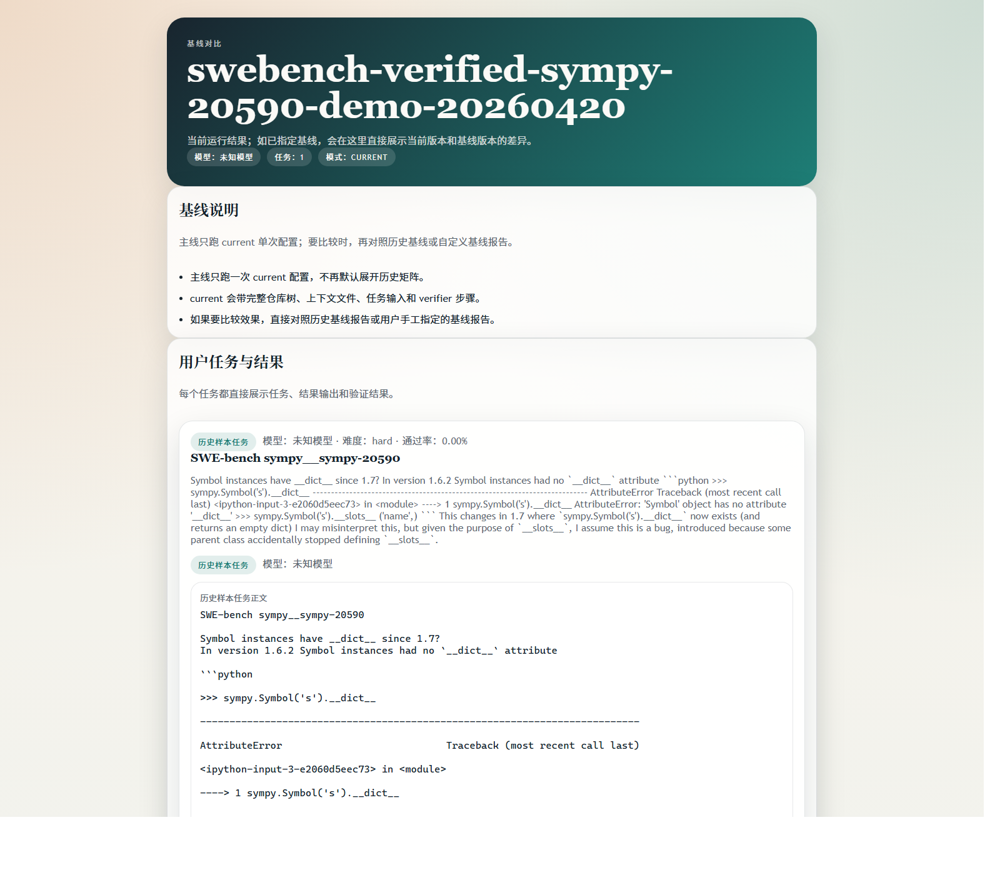
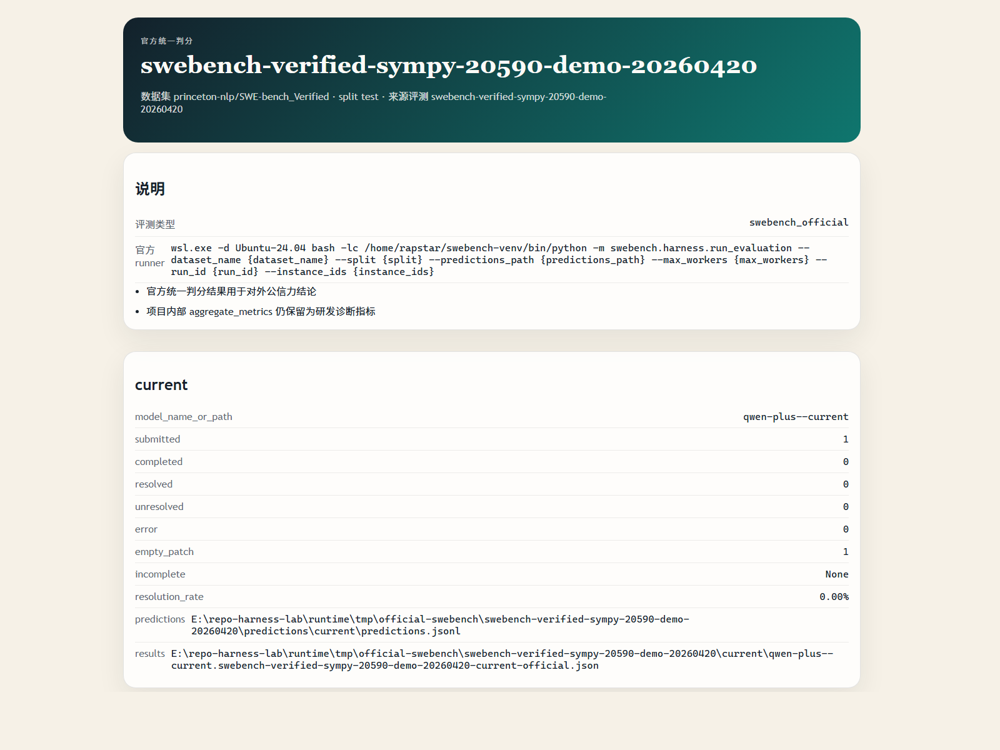
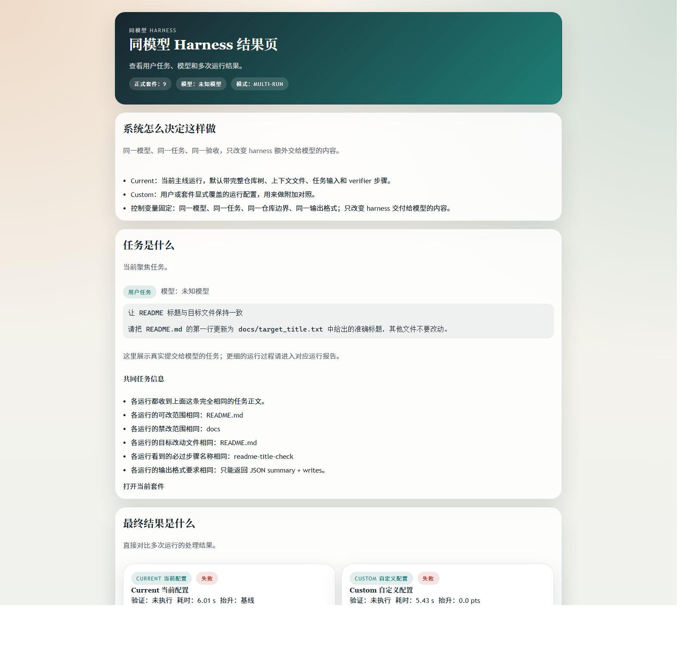

# Repo Harness Lab

[English](README.md)

许可证：MIT

Repo Harness Lab 是一个面向真实仓库任务的本地优先 harness。它把模糊请求整理成可审计任务，在隔离工作区副本里执行，用确定性验证做验收，并把解释结果所需的证据完整留下。

## 任务是什么

这个项目处理的是真实仓库任务，不是一次碰巧成功的聊天演示。

- 输入是仓库任务，不是一句随手 prompt。
- 系统关心仓库版本、可改范围、验收规则、能不能回放。
- 研究对象是代码 Agent 背后的 harness 工程，不是聊天壳。
- 核心问题很实际：任务到底是什么、模型看到了什么、为什么通过或失败、结论来自项目内 verifier 还是项目外官方 scorer。

## 系统怎么决定这样做

系统会先把模糊请求整理成有边界的任务包，再进入执行。

- 它会把 intake 或 benchmark manifest 映射成结构化仓库任务。
- 它会固定仓库来源、可改范围、预计改动文件、上下文文件和 verifier 步骤。
- 它支持把 SWE-bench 风格实例导出成可运行 manifest。
- 它会保留 benchmark 元数据，并明确区分项目内诊断和官方 benchmark 语义。

## 实际怎么执行

执行主线是固定链路，不会直接改源仓库。

1. 先把输入物化成带固定来源和验收规则的仓库任务。
2. 再把目标仓库复制到隔离工作区副本。
3. 模型只在这个副本里运行。
4. 然后执行确定性 verifier 命令。
5. 如果需要项目外结论，再把已落盘报告交给官方 SWE-bench scorer。

## 拿到了哪些关键证据

每次运行都会尽量留下足够证据，方便解释结果。

- 工作区执行记录
- `patch.diff`
- trace events
- verifier 输出
- 渲染后的 run / eval 报告
- 开启外部判分时的官方 scorer 产物

下面这些截图都来自已经落盘的本地报告页：

| benchmark 套件证据 | 官方 scorer 证据 |
| --- | --- |
|  |  |



## 最终结果是什么

当前对外讲的是研究结论，不是产品上线喜报。

- 当前公开主线：官方仓库上的外部 benchmark 执行研究
- 当前优先赛道：SWE-bench Verified
- 当前默认实验形态：单次 `current` 运行，必要时对照已落盘基线
- 当前结论：官方判分链路已经打通，真正主问题仍是模型在真实 benchmark 任务上没有稳定产出有效且非空的补丁

## 还可以往下看什么细节

如果你想快速继续往下看，可以从这里开始。

环境要求：

- Python `3.11+`
- Windows、macOS、Linux
- 如果要跑真实模型示例，需要 provider API Key

先安装：

```bash
python -m venv .venv
# Windows PowerShell: .venv\Scripts\Activate.ps1
# macOS/Linux: source .venv/bin/activate
python -m pip install -U pip
python -m pip install -e .[dev]
python -m repo_harness_lab.cli.main show-settings
```

先预览默认单题 intake，再直接跑一条：

```bash
python -m repo_harness_lab.cli.main preview-intake examples/intakes/portal_tetris_task_intake.json --format both
python -m repo_harness_lab.cli.main run-intake-eval examples/intakes/portal_tetris_task_intake.json --provider qwen --model qwen-plus --api-key-env DASHSCOPE_API_KEY
```

如果要走 benchmark 到官方判分：

```bash
python -m repo_harness_lab.cli.main export-swebench-manifest examples/benchmarks/swe_bench_sample_instances.jsonl runtime/tmp/swe_bench_sample.manifest.json --benchmark-id swe-bench-sample --metric-name resolved_rate --default-verifier-command-json "[\"python\", \"-m\", \"pytest\", \"-q\"]"
python -m repo_harness_lab.cli.main run-benchmark-eval runtime/tmp/swe_bench_sample.manifest.json --provider qwen --model qwen-plus --api-key-env DASHSCOPE_API_KEY
python -m repo_harness_lab.cli.main grade-swebench-official <report-id> --model-name qwen-plus
```

参考文档：

- [外部 benchmark 主链](docs/benchmarks/EXTERNAL_BENCHMARK_LANE.md)
- [官方 SWE-bench 判分](docs/benchmarks/SWEBENCH_OFFICIAL_EVALUATION.md)
- [示例目录](examples/README.md)

重要边界：

- 这不是一个通用聊天式代码助手。
- 项目内诊断指标不等于官方 benchmark 分数。
- 本地运行产物、隔离工作区、私有日志、环境文件默认不进 Git 历史。

## 许可证

MIT，见 [LICENSE](LICENSE)。
